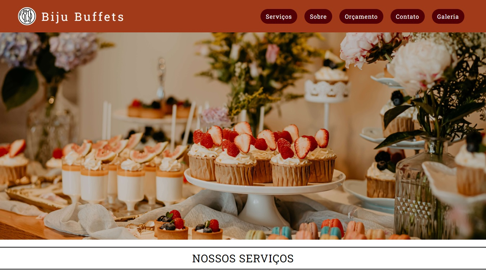
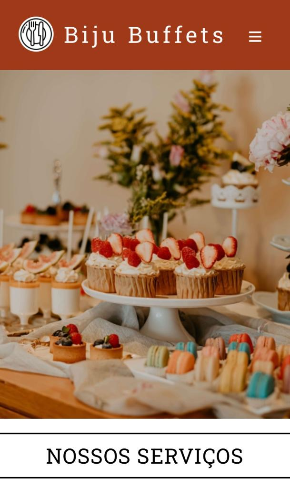

# Projeto Landing Page de Restaurante

Projeto pessoal que fiz inspirado na minha paixão por Gastronomia! :heart:

## Screenshots do projeto

### Desktop

### Mobile

## Tecnologias utilizadas

- HTML
- CSS

## Desafios
O maior desafio foi a implantação do menu hambúrguer no mobile! Além disso, ainda estou aprendendo a usar o flexbox da melhor maneira.

## Coisas que aprendi
- Melhorei meus conhecimentos em posicionamento com flexbox;
- Fazer um site responsivo.

## Futuro do projeto
- Melhorar a semântica do HTML;
- Refatorar o código;
- Trabalhar com variáveis no CSS.
